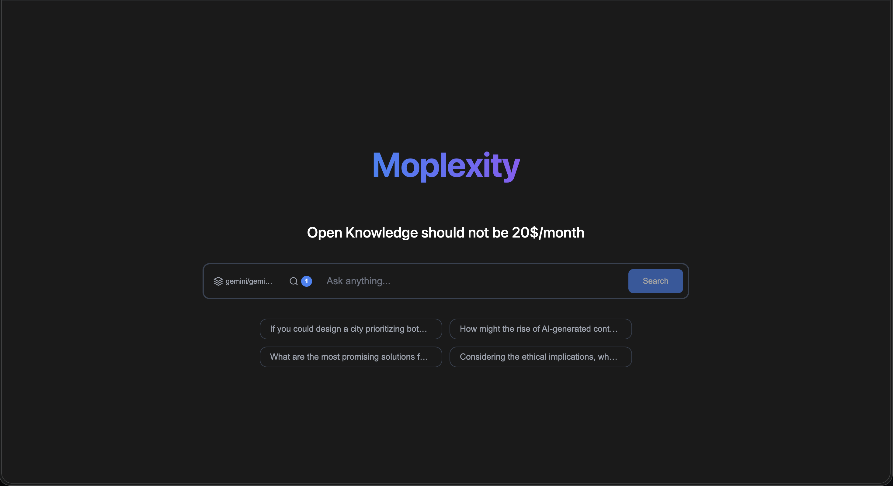
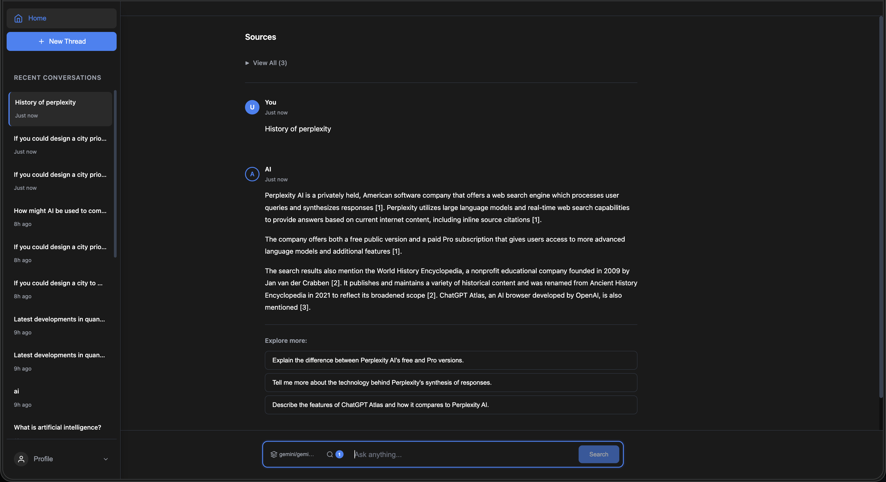
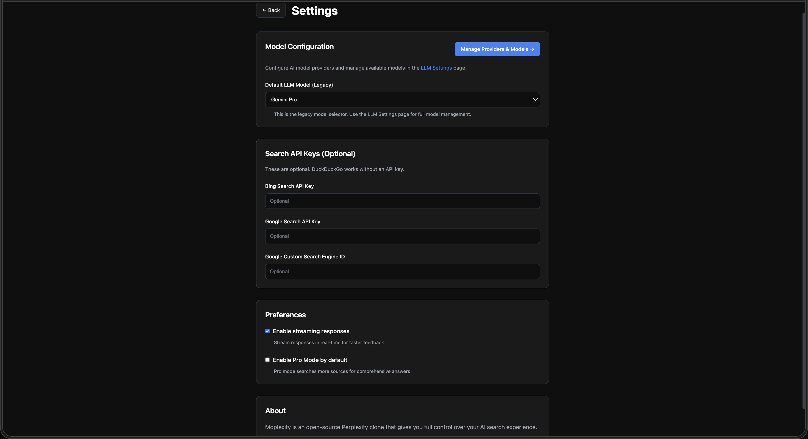

<div align="center">
  
  <h1>Moplexity</h1>
  <p><strong>Open-source AI search assistant - Open Knowledge should not be $20/month</strong></p>
  
  [](https://opensource.org/licenses/MIT)
  [](https://www.python.org/)
  [](https://vuejs.org/)
  [](https://fastapi.tiangolo.com/)
  [](https://www.docker.com/)
</div>

---

Moplexity is an open-source alternative to Perplexity AI. It combines multi-source web search with configurable LLM APIs to provide AI-powered answers with citations, giving you full control over your AI search experience.

## Features

- **Multi-Source Search**: Cascading search through DuckDuckGo, Bing, and Google
- **YouTube Transcripts**: Extract and search through video transcripts
- **Reddit Integration**: Search Reddit discussions via RSS feeds
- **Flexible AI Models**: Use any LLM via LiteLLM (OpenAI, Anthropic, Google, etc.)
- **Conversation History**: All chats and sources stored in SQLite
- **Streaming Responses**: Real-time AI responses with Server-Sent Events
- **Clean Interface**: Modern UI built with Vue.js
- **Easy Deployment**: Docker and Docker Compose support

## Screenshots

<div align="center">
  
  <p><em>Main search interface with conversation history</em></p>
  
  
  <p><em>AI responses with source citations</em></p>
  
  
  <p><em>Model selection and configuration</em></p>
</div>

> **Note**: Screenshots should be added to `docs/screenshots/` directory. Create the directory and add your screenshots with the names above.

## Quick Start

### Docker (Recommended)

```bash
git clone https://github.com/yourusername/moplexity.git
cd moplexity
cp backend/.env.example backend/.env
# Edit backend/.env and add your API keys
docker-compose up --build
```

Open http://localhost:3000

### Local Development

```bash
git clone https://github.com/yourusername/moplexity.git
cd moplexity
chmod +x setup.sh
./setup.sh
```

Start backend:
```bash
cd backend
source venv/bin/activate
uvicorn app.main:app --reload
```

Start frontend (new terminal):
```bash
cd frontend
npm run dev
```

Open http://localhost:5173

## Configuration

### Backend

Edit `backend/.env`:

```env
LITELLM_MODEL=gpt-3.5-turbo
OPENAI_API_KEY=your_key_here
# ANTHROPIC_API_KEY=your_key_here
# GOOGLE_API_KEY=your_key_here
```

### Supported LLM Models

- OpenAI: `gpt-3.5-turbo`, `gpt-4`, `gpt-4-turbo-preview`
- Anthropic: `claude-3-sonnet-20240229`, `claude-3-opus-20240229`
- Google: `gemini-pro`
- Many more via [LiteLLM](https://github.com/BerriAI/litellm)

## Architecture

**Backend**: FastAPI + Python + SQLite + LiteLLM  
**Frontend**: Vue 3 + Vite + Pinia  
**Search**: DuckDuckGo (primary), Bing, Google, Reddit RSS, YouTube transcripts

## API Documentation

When backend is running:
- Swagger UI: http://localhost:8000/docs
- ReDoc: http://localhost:8000/redoc

## Features in Detail

**Multi-Source Search**: Cascading strategy - DuckDuckGo → Bing → Google, plus Reddit RSS and YouTube transcripts in parallel.

**Pro Mode**: Enable for more search results (15 vs 10), deeper analysis, and more comprehensive answers.

**Streaming Responses**: Real-time AI responses using Server-Sent Events for better UX.

## Project Structure

```
moplexity/
├── backend/          # FastAPI backend
├── frontend/         # Vue.js frontend
├── docker-compose.yml
└── setup.sh          # Setup script
```

## Contributing

Contributions welcome! Please feel free to submit a Pull Request.

## License

MIT License - feel free to use this project for any purpose.

## Acknowledgments

- Inspired by [Perplexity AI](https://www.perplexity.ai/)
- Built with [LiteLLM](https://github.com/BerriAI/litellm)
- Search powered by DuckDuckGo, Bing, and Google

---

**Note**: This project requires API keys for LLM providers. DuckDuckGo search works without an API key, but Bing and Google search require their respective API keys.
